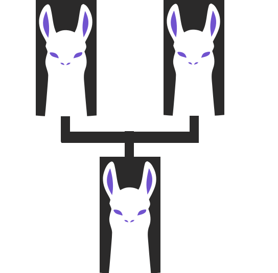

<p align="center">
  
</p>

<h1 align="center">khonliang-genealogy-example</h1>

<p align="center">
  LLM-backed genealogy research tool — example project demonstrating <a href="https://github.com/tolldog/ollama-khonliang">ollama-khonliang</a> as a dependency.
</p>

This is a **showcase application** that exercises most of khonliang's feature set: multi-tree management, cross-tree matching with a dedicated MatchAgent, consensus voting, debate orchestration, personality-driven routing, knowledge management, self-evaluation, research coordination, and MCP server exposure.

## Features

### Core

- **GEDCOM parser** — loads standard genealogy files (2,067 persons, 605 families tested)
- **Multi-tree forest** — manage multiple named GEDCOM trees with qualified xrefs, tree switching in the web UI
- **Cross-tree matching** — heuristic scoring (name/date/place/family) + LLM-backed MatchAgent evaluation
- **GEDCOM import/export** — import with agent-driven sanity checking, export back to GEDCOM 5.5.1
- **Merge engine** — merge matched persons across trees with configurable strategies (prefer_target, prefer_source, merge_all)
- **4 LLM roles** — researcher, fact checker, narrator, match agent with strict grounding rules
- **Intent classifier** — LLM-based skill detection with compound intent support
- **Query parser** — natural language to structured filters ("men from Ohio before 1920")
- **Model routing** — complexity-based model classification per query (model escalation to larger tiers can be enabled via per-role config)
- **Session context** — multi-turn coherence via `contextvars` (async-safe per WebSocket connection)
- **Config-driven** — YAML config for ports, models, themes; env var overrides

### Research

- **Web search** — DDG + Google + Bing in parallel with relevance filtering
- **API engines** — WikiTree and Geni.com searched alongside web engines
- **Research pool** — threaded researchers with background task queuing and priority
- **Research triggers** — `!` commands and implicit research on LLM uncertainty

### Knowledge

- **Three-tier knowledge** — axioms (immutable rules), imported (user documents), derived (agent-built)
- **Triple store** — semantic (subject, predicate, object) facts with confidence decay
- **Librarian** — auto-indexes responses, quality assessment, conflict detection

### Quality

- **Self-evaluation** — validates responses against tree data; flags date mismatches, wrong relationships, speculation, and uncertainty
- **Consensus voting** — when self-eval finds high-severity issues, all 3 roles vote on response quality (approve/reject/defer)
- **Debate orchestration** — structured challenge/response rounds between disagreeing agents before final consensus
- **Heuristic learning** — records evaluation outcomes, extracts rules, injects learned patterns into future system prompts

### Personalities

- **@mention routing** — `@skeptic check this birth record` routes to a personality-specific prompt
- **4 genealogy personas** — genealogist (primary sources), historian (historical context), detective (brick wall breaker), skeptic (source critic)
- **4 built-in personas** — resolver, analyst, advocate, skeptic (from khonliang defaults)
- **Weighted voting** — each personality carries a voting weight used in consensus

### Feedback

- **Interaction logging** — every LLM interaction logged with role, timing, and metadata
- **User ratings** — `/rate 1-5 [feedback]` rates the last response
- **Training export** — rated interactions can be exported as fine-tuning datasets (Alpaca, ShareGPT, completion formats)
- **RAG indexing** — high-rated feedback auto-indexed for retrieval

### Analysis

- **Tree analysis** — dead ends, date anomalies, missing data, gap detection
- **Reports** — person dossiers, knowledge summaries, gap analysis, session reports

### Integration

- **WebSocket chat server** — web UI + CLI client + tool interface
- **MCP server** — tree queries, knowledge tools, feedback stats, heuristics, and personalities exposed to external LLMs
- **CLI tool** — `genealogy` command for scripted access

## Quick Start

```bash
# Install (requires Ollama running locally)
pip install -e .

# Place your GEDCOM file in data/
mkdir -p data
cp /path/to/your/family.ged data/

# Load and explore
genealogy load data/family.ged
genealogy search data/family.ged "Smith"
genealogy chat data/family.ged

# Start the chat server — GEDCOM path comes from config.yaml or env var
# Option A: edit app.gedcom in config.yaml (see Configuration section below)
# Option B: override on the command line:
GEDCOM_FILE=data/family.ged python -m genealogy_agent.server

# Connect via CLI
python -m genealogy_agent.chat_client

# Or open http://localhost:8766 in a browser
```

## Chat Commands

### Research Commands

| Command | Description |
|---------|-------------|
| Regular text | Routes to researcher/narrator/fact_checker via intent classification |
| `!lookup: name` | Web search across DDG + Google + Bing for a specific person |
| `!search: query` | General web search |
| `!google: query` | Google search |
| `!fetch: url` | Fetch and extract page content |
| `!fetch ingest url` | Fetch and save to knowledge |

### Tree Commands

| Command | Description |
|---------|-------------|
| `!tree: name` | Structured tree data lookup |
| `!ancestors: name` | Ancestor chain |
| `!migration: name` | Migration timeline |
| `!gaps [name]` | Gap analysis (dead ends, anomalies) |
| `!dead-ends name [research]` | Find dead-end ancestors, auto-research |
| `!anomalies` | Find date errors in tree |
| `!researchwho criteria` | Filter tree + batch web research |

### Multi-Tree & Matching Commands

| Command | Description |
|---------|-------------|
| `!trees` | List all loaded trees with person/family counts |
| `!load name path.ged` | Import a GEDCOM file with sanity checking |
| `!import path.ged [name]` | Import with full sanity + scan pipeline |
| `!export tree_name [path]` | Export tree to GEDCOM format |
| `!scan [tree_a] [tree_b]` | Cross-tree heuristic matching + MatchAgent evaluation |
| `!matches [name]` | Show pending match candidates and confirmed links |
| `!link tree:@I1@ tree:@I2@` | Confirm a match (stores as same_as triple) |
| `!merge source into target [strategy]` | Merge matched person data |

### Knowledge Commands

| Command | Description |
|---------|-------------|
| `!ingest title \| content` | Add to knowledge (Tier 2) |
| `!ingest-file path` | Ingest a file |
| `!knowledge` | Show knowledge store status |
| `!axiom` | List/set axioms (Tier 1) |
| `!promote entry_id` | Promote knowledge entry from Tier 3 to Tier 2 |
| `!demote entry_id` | Demote knowledge entry from Tier 2 to Tier 3 |
| `!prune` | Clean up low-quality knowledge |
| `/search query` | Search knowledge base |

### Report Commands

| Command | Description |
|---------|-------------|
| `!report [name]` | Person report or knowledge summary |
| `!report gaps [name]` | Gap analysis report |
| `!session` | Session summary |

### Personality & Feedback

| Command | Description |
|---------|-------------|
| `@genealogist query` | Route to genealogy researcher persona |
| `@historian query` | Route to historical contextualizer |
| `@detective query` | Route to brick wall breaker |
| `@skeptic query` | Route to source critic |
| `/rate 1-5 [feedback]` | Rate last response (stored for training) |

## Khonliang Features Demonstrated

This project exercises the following khonliang modules, making it a comprehensive reference for building applications with the framework:

### Clients & Model Management

```python
from khonliang import ModelPool
from khonliang.client import OllamaClient
```

- `ModelPool` manages three models with different keep-alive policies (researcher stays hot at 30m, fact_checker and narrator unload after 5m)
- `OllamaClient` used directly for intent classification and complexity routing

### Roles & Routing

```python
from khonliang.roles.base import BaseRole
from khonliang.roles.router import BaseRouter
from khonliang.roles.session import SessionContext
from khonliang.routing import ComplexityStrategy, ModelRouter
```

- Three domain roles (`ResearcherRole`, `FactCheckerRole`, `NarratorRole`) extend `BaseRole`
- `GenealogyRouter` extends `BaseRouter` with keyword-based dispatch
- `SessionContext` provides async-safe multi-turn conversation memory via `contextvars`
- `ModelRouter` + `ComplexityStrategy` classify query complexity per role (model selection is single-tier by default; extend `role_models` config for multi-tier escalation)

### Knowledge Management

```python
from khonliang.knowledge import KnowledgeStore, Librarian
from khonliang.knowledge.store import Tier
from khonliang.knowledge.triples import TripleStore
```

- Three-tier knowledge hierarchy: axioms (grounding rules), imported (user research), derived (agent responses)
- `Librarian` handles ingestion, promotion/demotion, pruning, and context assembly
- `TripleStore` for semantic fact representation

### Research Coordination

```python
from khonliang.research import ResearchPool, ResearchTrigger
from khonliang.research.base import BaseResearcher
from khonliang.research.engine import BaseEngine, EngineResult
from khonliang.research.models import ResearchTask, ResearchResult
```

- `ResearchPool` queues and executes research tasks with priority ordering
- `ResearchTrigger` maps `!` command prefixes to task types and detects implicit research needs from LLM responses
- Custom `BaseResearcher` implementations for web search and tree lookup
- Custom `BaseEngine` implementations for WikiTree and Geni.com APIs

### Self-Evaluation

```python
from khonliang.roles.evaluator import BaseEvaluator, EvalRule, EvalIssue
```

- `BaseEvaluator` with composition-based rule system
- Custom `DateCheckRule` and `RelationshipCheckRule` verify LLM claims against GEDCOM data
- Built-in `SpeculationRule` and `UncertaintyRule` detect hedging language

### Consensus & Debate

```python
from khonliang.consensus import AgentTeam, AgentVote, ConsensusEngine, ConsensusResult
from khonliang.debate import DebateOrchestrator, DebateConfig
```

- `GenealogyVotingAgent` wraps existing roles as voting agents (implements `analyze()` and `reconsider()`)
- `ConsensusEngine` aggregates weighted votes with VETO support
- `AgentTeam` fans out evaluation to all agents in parallel
- `DebateOrchestrator` detects high-confidence disagreements and runs structured challenge/response rounds
- Consensus triggers automatically when self-evaluation finds high-severity issues

### Personalities

```python
from khonliang.personalities import PersonalityRegistry, PersonalityConfig
from khonliang.personalities import extract_mention, build_prompt, format_response
```

- `PersonalityRegistry` with 4 genealogy-specific + 4 built-in personas
- `extract_mention()` parses `@persona` from user messages
- `build_prompt()` constructs persona-appropriate system prompts
- `format_response()` wraps responses with persona headers and voting weight footers

### Training & Feedback

```python
from khonliang.training import FeedbackStore, HeuristicPool
```

- `FeedbackStore` logs every interaction with role, timing, session_id, and metadata
- User ratings stored via `add_feedback()` and surfaced through `get_stats()`
- `HeuristicPool` records evaluation outcomes (success/failure by role and query type)
- Learned heuristic rules injected into role system prompts via `build_prompt_context()`

### Integration

```python
from khonliang.integrations.websocket_chat import ChatServer
from khonliang.mcp import KhonliangMCPServer
from khonliang.gateway.blackboard import Blackboard
```

- `GenealogyChat` extends `ChatServer` with session management, evaluation, and consensus
- `GenealogyMCPServer` extends `KhonliangMCPServer` with tree-specific + training tools
- `Blackboard` for shared state across MCP context

## Tool Interface (for external LLMs)

The tool module reads the GEDCOM path from `GEDCOM_FILE` env var (or `app.gedcom` in `config.yaml`):

```bash
GEDCOM_FILE=data/family.ged python -m genealogy_agent.tool summary
python -m genealogy_agent.tool person "Timothy Toll"
python -m genealogy_agent.tool ancestors "Timothy Toll" --generations 4
python -m genealogy_agent.tool migration "Timothy Toll"
python -m genealogy_agent.tool websearch "Roger Tolle"
python -m genealogy_agent.tool query "Who were Timothy's grandparents?"
```

## MCP Server (for Claude Code / external LLMs)

The genealogy MCP server exposes tree queries, knowledge tools, and training features so external LLMs can interact with the family tree directly.

```bash
# Run MCP server (stdio for Claude Code)
python -m genealogy_agent.mcp_server

# Or HTTP for remote access (bind on all interfaces)
python -m genealogy_agent.mcp_server --transport http --host 0.0.0.0 --port 8080
```

Add to `.mcp.json` for Claude Code:

```json
{
  "mcpServers": {
    "genealogy": {
      "command": "python",
      "args": ["-m", "genealogy_agent.mcp_server"]
    }
  }
}
```

### Tree Tools

| Tool | Description |
|------|-------------|
| `tree_summary` | Tree statistics (person count, families, date range) |
| `tree_search(query)` | Search persons by name |
| `tree_person(name)` | Detailed person info with family |
| `tree_ancestors(name, generations)` | Ancestor chain |
| `tree_descendants(name, generations)` | Descendant chain |
| `tree_migration(name)` | Migration timeline through ancestor line |
| `tree_context(name)` | Raw LLM context for a person |
| `tree_gaps(name)` | Gap analysis and research opportunities |

### Training Tools

| Tool | Description |
|------|-------------|
| `feedback_stats` | Interaction and feedback statistics |
| `heuristic_list` | Learned rules extracted from outcomes |
| `personality_list` | Available @mention personalities |

Plus all khonliang tools: `knowledge_search`, `knowledge_ingest`, `triple_add`, `blackboard_post`, `invoke_role`, etc.

## Configuration

Edit `config.yaml`:

```yaml
server:
  host: "0.0.0.0"
  ws_port: 8765
  web_port: 8766

app:
  title: "Genealogy Agent"
  gedcom: "data/family.ged"
  knowledge_db: "data/knowledge.db"

ollama:
  url: "http://localhost:11434"
  models:
    researcher: "llama3.2:3b"      # Fast model for Q&A
    fact_checker: "qwen2.5:7b"     # Medium model for validation
    narrator: "llama3.1:8b"        # Larger model for narratives

personalities:
  enabled: true                    # Enable @mention personality routing

consensus:
  enabled: true                    # Enable consensus voting on eval failures
  timeout: 30                      # Seconds per voting agent
  debate_enabled: true             # Enable structured debate on disagreements
  debate_rounds: 2                 # Max debate rounds
  disagreement_threshold: 0.6     # Confidence threshold to trigger debate

training:
  feedback_enabled: true           # Log interactions to FeedbackStore
  heuristics_enabled: true         # Record outcomes and learn heuristic rules

theme:
  primary: "#e94560"
  background: "#1a1a2e"
```

Environment variable overrides: `OLLAMA_URL`, `GEDCOM_FILE`, `WS_PORT`, `WEB_PORT`, `APP_TITLE`.

API credentials (set in environment or `.env`): `GENI_API_KEY`, `GENI_API_SECRET`, `GENI_APP_ID`.

## Architecture

```text
User (browser/CLI/tool)
  -> WebSocket Chat Server (GenealogyChat)
    -> /rate command          -> FeedbackStore (log rating)
    -> @mention               -> PersonalityRegistry -> formatted response
    -> ! command              -> ResearchChatHandler -> ResearchPool
    -> natural language       -> Intent Classifier (LLM-based)
                              -> Session Context (contextvars, async-safe)
                              -> Model Router (complexity-based model selection)
                              -> Router -> Specialist Role (researcher/fact_checker/narrator)
                                           |
                                           v
                              -> Self-Evaluator (date/relationship/speculation checks)
                                  |
                                  +-- passed? -> append caveat if needed
                                  |
                                  +-- high-severity issues?
                                       -> Consensus Voting (all 3 roles vote)
                                           -> Debate (if disagreement detected)
                                           -> Final consensus decision
                                  |
                                  +-- uncertainty/date mismatch?
                                       -> Auto-queue background research
                              -> HeuristicPool (record outcome, learn rules)
                              -> FeedbackStore (log interaction)
                              -> Librarian (auto-index to Tier 3 knowledge)
```

### Message Flow

1. **Routing**: User input is checked for `/rate`, `@mention`, `!` commands, then classified by intent
2. **Context**: Session history (last 5 exchanges) and tree data injected into prompt
3. **Generation**: Role generates response with complexity-appropriate model; learned heuristic rules included in system prompt
4. **Evaluation**: Response checked against GEDCOM data for factual accuracy
5. **Consensus** (conditional): If high-severity issues found, all roles vote; debate runs on disagreements
6. **Learning**: Outcome recorded for heuristic extraction; interaction logged for feedback

### Data Flow

```text
Knowledge DB (SQLite)
  +-- KnowledgeStore (3-tier: axiom/imported/derived)
  +-- TripleStore (semantic facts)
  +-- FeedbackStore (interactions + ratings)
  +-- HeuristicPool (outcomes + learned rules)
  +-- RAG documents (full-text search)
```

All stores share `data/knowledge.db` for simplicity. The `Librarian` manages the knowledge lifecycle while `FeedbackStore` and `HeuristicPool` handle the training feedback loop.

## Project Structure

```text
genealogy_agent/
  __init__.py
  server.py           # Chat server: wires all components, handles message flow
  config.py            # YAML config loader with env var overrides
  gedcom_parser.py     # GEDCOM file parser (persons, families, relationships)
  forest.py            # TreeForest: multi-tree management with qualified xrefs
  cross_matcher.py     # Heuristic cross-tree person matching (name/date/place/family)
  match_agent.py       # MatchAgentRole: LLM-backed match evaluation + consensus voting
  importer.py          # GEDCOM import with sanity checking + export
  merge.py             # MergeEngine: merge matched persons across trees
  router.py            # GenealogyRouter: keyword-based role dispatch
  roles.py             # ResearcherRole, FactCheckerRole, NarratorRole
  intent.py            # LLM-based intent classifier
  query_parser.py      # Natural language to structured query filters
  self_eval.py         # DateCheckRule, RelationshipCheckRule + evaluator factory
  consensus.py         # GenealogyVotingAgent, consensus team + debate factories
  personalities.py     # Genealogy-specific personality definitions
  chat_handler.py      # ResearchChatHandler: ! command dispatch
  researchers.py       # WebSearchResearcher, TreeResearcher
  web_search.py        # DDG + Google + Bing parallel search
  tree_analysis.py     # Dead ends, anomalies, gap detection
  reports.py           # Person/knowledge/gap/session report builder
  skills.py            # Skill definitions for intent classifier
  tool.py              # CLI tool interface for external LLMs
  mcp_server.py        # MCP server: tree + forest + training tools
  web_server.py        # Static web UI server
  chat_client.py       # CLI WebSocket chat client
  web/
    index.html         # Web UI with tree selector, import/export buttons
  engines/
    wikitree.py        # WikiTree search helpers
    wikitree_engine.py # WikiTree BaseEngine implementation
    geni.py            # Geni.com search helpers
    geni_engine.py     # Geni.com BaseEngine implementation
```

## License

MIT
